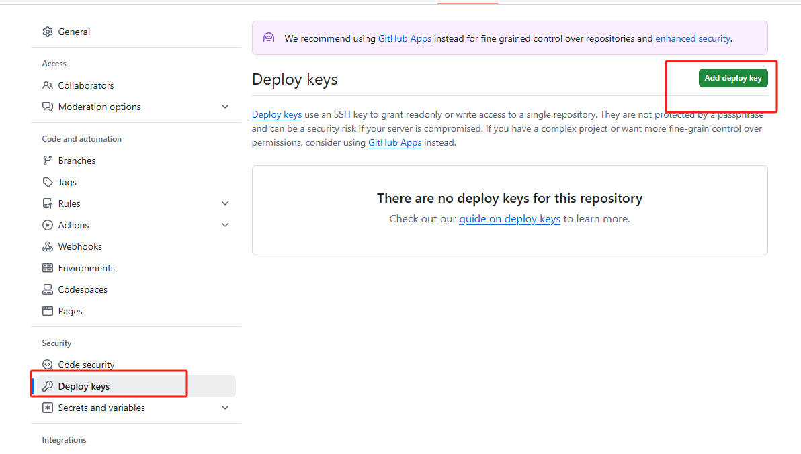

# 在本地编辑文件并同步到GitHub

1. 配置一下用户名和邮箱

```bash
git config --global user.name "Your Name"
git config --global user.email "email@yyy.com"
```


2. 新建一个文件夹，名字xxx，之后进入该文件夹，打开git bash，然后输入`git init`命令，初始化git仓库


3. 创建GitHub仓库，设置为公开，并且执行下面命令来将本地仓库与GitHub仓库关联

```bash
git remote add origin https://github.com/您的用户名/仓库名.git
```


4. 执行下面命令，生成ssh密钥对，远程连接服务器的协议，这里是用来连接GitHub的，并在密钥中添加一个标识注释（通常是您的电子邮件地址）。生成的密钥对包括一个私钥（保密）和一个公钥（可以公开分享）。

```bash
ssh-keygen -t rsa -C "youremail@example.com"
```

> **`-t rsa`**：
>
> - `-t` 选项指定了密钥类型。这里的 `rsa` 表示生成 RSA 类型的密钥。RSA 是一种常见的加密算法，用于生成公钥和私钥。
> - `-t rsa` 就是告诉 `ssh-keygen` 使用 RSA 算法生成密钥对。
>
> 
>
> **`-C "youremail@example.com"`**：
>
> - `-C` 选项用于添加一个注释（通常是邮箱地址），来标识生成的密钥。这里的 `"youremail@example.com"` 是您自己的电子邮件地址或其他标识信息。
> - 这个注释通常用于标识该密钥是属于哪个用户的，尤其是当您有多个密钥时，通过注释可以轻松识别它。

```python
如果您想在生成时修改 SSH 密钥文件的名称，执行下面命令

ssh-keygen -t rsa -C "youremail@example.com" -f ~/.ssh/my_custom_key

如果想修改现有的密钥的文件名

mv ~/.ssh/id_rsa ~/.ssh/my_custom_key
mv ~/.ssh/id_rsa.pub ~/.ssh/my_custom_key.pub
```


5.  复制公钥内容，添加到GitHub中

```bash
cd ~/.ssh/
cat id_rsa.pub
# 上面这个id_rsa 看自己当时是什么名称，默认是id_rsa

# 然后GitHub是在图中的位置，仓库的settings中
```




6. 之后就🆗了，可以进行文件推送了

> 当然，保险起见，可以再进行一次认证，也就是执行下面俩命令：
>
> git config --global user.name "Your Name"
> git config --global user.email "email@yyy.com"


7. 然后，修改远程URL为SSH形式

```bash
git remote set-url origin git@github.com:Carolynhomes/MyDaily.git
# 之后使用push的时候，不会再请求密码或者令牌
```


最后执行一系列命令即可:

```bash
# 将所有文件添加到暂存区
git add .

# 将暂存区中的内容提交到版本库
git commit -m "descriptions"

# 将本地库推送到远程库
git push -u origin master
# git push origin master
```

