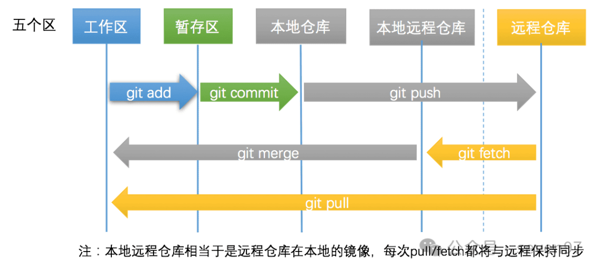

# 1 在本地编辑文件并同步到GitHub

1. 配置一下用户名和邮箱

```bash
git config --global user.name "Your Name"
git config --global user.email "email@yyy.com"
```


2. 新建一个文件夹，名字xxx，之后进入该文件夹，打开git bash，然后输入`git init`命令，初始化git仓库


3. 创建GitHub仓库，设置为公开，并且执行下面命令来将本地仓库与GitHub仓库关联

```bash
git remote add origin https://github.com/您的用户名/仓库名.git
```


4. 执行下面命令，生成ssh密钥对，远程连接服务器的协议，这里是用来连接GitHub的，并在密钥中添加一个标识注释（通常是您的电子邮件地址）。生成的密钥对包括一个私钥（保密）和一个公钥（可以公开分享）。

```bash
ssh-keygen -t rsa -C "youremail@example.com"
```

> **`-t rsa`**：
>
> - `-t` 选项指定了密钥类型。这里的 `rsa` 表示生成 RSA 类型的密钥。RSA 是一种常见的加密算法，用于生成公钥和私钥。
> - `-t rsa` 就是告诉 `ssh-keygen` 使用 RSA 算法生成密钥对。
>
> 
>
> **`-C "youremail@example.com"`**：
>
> - `-C` 选项用于添加一个注释（通常是邮箱地址），来标识生成的密钥。这里的 `"youremail@example.com"` 是您自己的电子邮件地址或其他标识信息。
> - 这个注释通常用于标识该密钥是属于哪个用户的，尤其是当您有多个密钥时，通过注释可以轻松识别它。

```python
如果您想在生成时修改 SSH 密钥文件的名称，执行下面命令

ssh-keygen -t rsa -C "youremail@example.com" -f ~/.ssh/my_custom_key

如果想修改现有的密钥的文件名

mv ~/.ssh/id_rsa ~/.ssh/my_custom_key
mv ~/.ssh/id_rsa.pub ~/.ssh/my_custom_key.pub
```


5.  复制公钥内容，添加到GitHub中

```bash
cd ~/.ssh/
cat id_rsa.pub
# 上面这个id_rsa 看自己当时是什么名称，默认是id_rsa

# 然后GitHub是在图中的位置，仓库的settings中
```


6. 之后就🆗了，可以进行文件推送了

> 当然，保险起见，可以再进行一次认证，也就是执行下面俩命令：
>
> git config --global user.name "Your Name"
> git config --global user.email "email@yyy.com"


7. 然后，修改远程URL为SSH形式

```bash
git remote set-url origin git@github.com:Carolynhomes/MyDaily.git
# 之后使用push的时候，不会再请求密码或者令牌
```


最后执行一系列命令即可:

```bash
# 将所有文件添加到暂存区
git add .

# 将暂存区中的内容提交到版本库
git commit -m "descriptions"

# 将本地库推送到远程库
git push -u origin master
# git push origin master
```

# 2 main和master的分支问题

1. 创建一个 main分支

```bash
git checkout -b main
```


2. 删除本地的 master分支

```bash
git branch -D master
```


3. 删除 github 仓库里的 master 分支

```bash
git push origin --delete master
```


4. 然后进行  git add commit push 

> [!important]
>
> 然后你进行 git add commit push 的时候，会出现下面问题：
>
> ```bash
> git add .
> git commit -m "descriptions"
> git push -u origin main
> ```
>
> 
>
> ```
> fatal: refusing to merge unrelated histories
> ```
>
> 此时会出现问题，因为本地 `main` 分支和远程 `main` 分支的历史记录没有共同的基础。Git 拒绝自动合并它们。
>
> 像这样：
>
> - 本地仓库和远程仓库是分开初始化的（例如，您在本地仓库中已有提交，而远程仓库也有自己的提交）。
> - 您刚开始使用 GitHub 时，远程仓库已经有内容，而本地仓库是全新的，或者本地与远程的历史完全不同。


**解决办法：**

**允许合并不相关的历史**： 您可以通过使用 `--allow-unrelated-histories` 选项来强制 Git 允许合并不相关的历史：

```bash
git pull origin main --allow-unrelated-histories
# 这将强制 Git 合并远程 main 分支与本地 main 分支，尽管它们没有共同的提交历史。

# 然后可能会让你记录一下commit
# 此时 按 i 进入 插入模式，随便输入点东西，告诉他你为什么进行合并
# 然后  点  ESC ，然后按 : 号，输入wq，即可保存退出 
```

之后 问题解决，只有一个main分支了

# 3 代码提交和同步命令

流程图：



第0步:工作区与仓库保持一致

​	这如果不一样的话，参考上面2中的某个报错

第1步: 文件增删改，变为已修改状态


第2步: `git add` ，变为已暂存状态

```bash
git status
git add --all # 当前项目下的所有更改
git add .  # 当前目录下的所有更改（多）
git add xx/xx.py xx/xx2.py  # 添加某几个文件
```

第3步：`git commit` 变为已提交状态

```bash
git commit -m "描述信息"
```

第4步：`git push` 变为已推送状态

```bash
git push -u origin main # 第一次需要关联上
git push # 之后再推送就不用指明应该推送的远程分支了

git branch # 可以查看本地仓库的分支
git branch -a # 可以查看本地仓库和本地远程仓库(远程仓库的本地镜像)的所有分支
```


