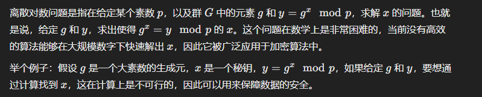
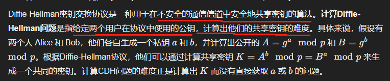

# 数据完整性审计

**数据完整性审计** 是指对存储在云端的数据进行验证，以确保其在存储过程中没有遭到篡改或丢失。尤其是在云存储环境中，数据的安全性和完整性变得更加重要，审计技术可以帮助用户验证数据是否遭到恶意篡改。

#### 1. **基本原理**

数据完整性审计的基本原理包括：

- **校验值（Checksum）**：一种简单的完整性校验方法，通过计算数据的校验和来验证数据是否发生变化。如果数据发生改变，校验值也会发生变化。常用的校验方法包括**MD5**、**SHA-1**和**SHA-256**。
- **哈希算法（Hashing Algorithm）**：哈希函数可以将任意长度的数据映射为固定长度的散列值（哈希值）。这个值唯一地标识数据，若数据发生变化，哈希值也会发生变化。常见的哈希算法包括**SHA-256**和**MD5**。
- **挑战-响应协议（Challenge-Response Protocol）**：这是审计系统与存储服务提供者之间交互的基本形式。验证方（通常是用户）向存储服务发起挑战请求，存储服务提供者响应并提供数据的完整性证明。验证方检查响应是否符合预期，从而确认数据的完整性。

#### 2. **常用方法**

- **Provable Data Possession（PDP）**`可证明数据占有性`：PDP方法允许用户在不下载全部数据的情况下验证云存储中的数据是否完整。**PDP的核心思想是**，通过生成数据的简短证明，用户可以向存储提供者请求验证，证明云存储中的数据没有被篡改或丢失。
- **Proof of Retrievability（PoR）`**可恢复性证明`：PoR方法要求存储服务提供一个证明，表明数据不仅是完整的，而且能够从云存储中检索到。PoR需要保证存储的数据在云端可用，且未被篡改。
- **多副本审计（Multi-Replica Auditing）**：针对存储在多个副本上的数据，审计需要验证每一个副本的数据完整性，确保数据在多个存储位置的副本一致。

# 离散对数问题

# CDH问题——计算Diffie-Hellman问题

