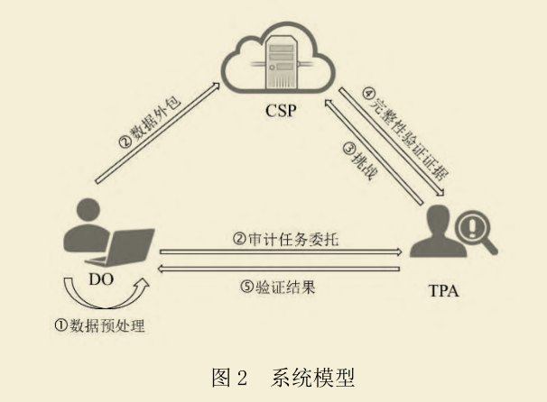
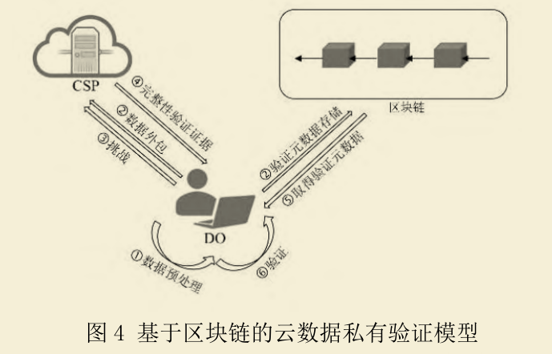
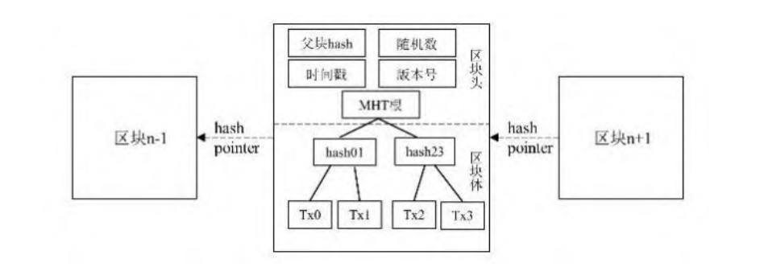
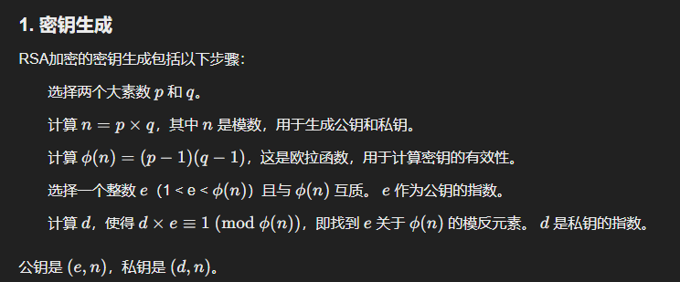
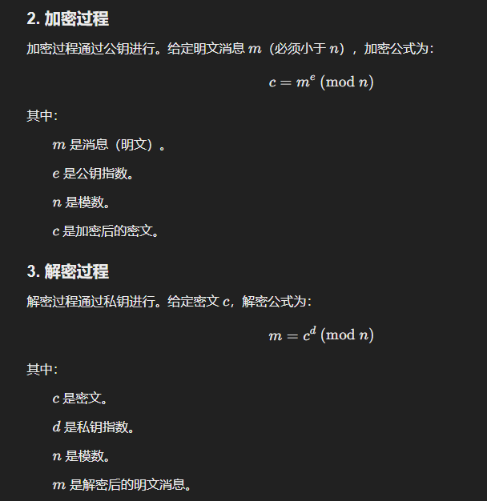

# 云数据完整性验证协议模型

通常云数据完整性验证协议的系统模型包含三方，分别是 DO（`数据拥有者`）、CSP （`云服务提供商`）以及 TPA（`第三方审计者`），如图所示：

- DO：可能是个人用户或者企业用户，拥有大量的数据，需要租用 CSP 的云存储服务来存储数据。 
- CSP：对外出租其足量的存储资源及计算资源来盈利。 
- TPA：具有一定的密码学计算能力，接受 DO 的委托代替其完成审计任务。

## 工作流程

（1）DO 对其要外包的数据进行预处理，例如分块、加密、编码等，然后对每个数据	块生成一个标签。 

（2）DO 将数据块及对应的标签集合发送给 CSP，并将审计任务委托给信任的 TPA。 

（3）TPA 定期生成挑战信息并发送给 CSP。 

（4）CSP 接收到挑战后，根据挑战内容生成完整性验证证据，返回给 TPA。 

（5）TPA 验证 CSP 返回的完整性验证证据，并及时将验证结果告知 DO。

## 存在的安全问题

​	在云存储数据完整性验证模型中，三方互不信任。

​	一方面，当 DO 存储在 CSP 中的数据发生损坏，CSP 会为了维护声誉或者意图逃避对 DO 的赔偿而不公开数据损坏的情况；CSP 也会删除用户不常用数据以节省存储空间。

​	另一方面 DO 可能会在数据完好的情况下诬陷 CSP，以得到 CSP的赔偿。最后，TPA 可能欺骗用户，做出违反完整性验证协议的行为，例如，TPA 可能会不执行挑战和验证的过程而总是返回验证通过的结果给 DO，以节省资源；又或者 TPA 会与 CSP 合谋，故意绕过损坏的数据块而总是去挑战完整的数据块来欺瞒用户。

总而言之，云数据完整验证协议可能会遇到以下攻击： 
（1）**伪造攻击：**CSP 伪造完整性验证证据绕过 TPA 的验证来掩盖用户数据受损的情况。 
（2）**替换攻击：**CSP 利用没有损坏的数据块及对应的标签来生成完整性验证证据绕过 TPA 的验证。 
（3）**重放攻击：**CSP 利用**之前生成的完整性验证证据**来绕过当前的 TPA 挑战，这样便不需要保存 DO 的数据以及标签。 
（4）**共谋攻击：**CSP 与 TPA 合谋，或通过精心设计挑战信息绕过损坏数据块，只挑战完好的数据块或返回虚假验证结果来欺瞒用户。

（5）**恶意推迟审计**：TPA可能会恶意推迟审计时间，直到委托期快结束时才集中完成审计任务，导致用户无法及时发现数据损坏。

针对上面(4)(5)这俩问题，提出了如下的解决方案：

使用公有链信息生成挑战：

- **Xue (2019)**：提出根据用户指定的时间从比特币公链上取得相应块中的`nonce`字段来构造挑战信息。
- **Armknecht (2014)**：提出根据用户给出的时间选取`比特币公链`中`最新块的哈希值`作为外部随机源来生成挑战信息。
- **Zhang (2019)**：提出通过`以太坊的区块高度`推算出`区块生成时间`，生成挑战信息，并生成日志记录和交易信息，以防御恶意推迟审计者的攻击。

## 批量审计

批量审计是指审计者 TPA 可以同时验证 CSP 返回的多个不同 DO 的完整性验证证据，而不是依次验证每个证据。

## 分布式审计

## 无块验证

利用同态验证标签（Homomorphic Verification Tag，HVT），可以使验证者能够在不接触到数据块的情况下实现对云数据的完整性验证，避免用户数据块在网络上频繁传输的情况，有效地降低**通信开销**。

# 基于区块链的云数据私有验证模型

> [!tip]
>
> 该图展示了一个基于区块链的云数据私有验证模型，流程包括数据上传、预处理、完整性验证、安全挑战、数据外包、区块链数据存储、验证元数据生成与获取以及最终的数据验证。区块链的引入确保了数据的安全性和不可篡改性，增强了整个模型的信任度。用户通过这一流程可以信任CSP处理数据，并能够验证数据的真实性，从而提高了数据处理的透明度和安全性。

### 1. **数据上传与预处理**

- **用户上传数据**：用户将需要处理的数据上传到云服务提供商（CSP）。
- **数据预处理**：CSP对上传的数据进行预处理，确保数据格式和结构符合后续验证的要求。

### 2. **完整性验证证据**

- **生成验证证据**：用户在上传数据时，会要求提供数据的完整性验证证据，以确保数据的真实性和完整性。

### 3. **挑战**

- **安全挑战**：用户需要对数据进行一个安全的挑战，以验证其身份或权限。这一步骤确保只有授权用户可以访问和操作数据。

### 4. **数据外包**

- **数据外包给CSP**：用户的数据被外包给CSP，由CSP进行处理和存储。

### 5. **区块链数据存储**

- **数据存储到区块链**：处理完成后，相关数据会被存储到区块链上，确保数据的安全性和不可篡改性。

### 6. **验证元数据**

- **生成验证元数据**：CSP会生成并提供验证元数据，供用户验证数据的完整性和真实性。

### 7. **获取验证元数据**

- **用户获取元数据**：用户从CSP那里获取验证元数据，用于后续的数据验证。

### 8. **验证**

- **数据验证**：用户使用获取的验证元数据对数据进行验证，确保数据未被篡改且完整。

# 基于区块链的云数据公有验证模型

> [!tip]
>
> 该图展示了一个基于区块链的云数据公有验证模型，流程包括数据上传、预处理、存储、验证请求、数据完整性验证以及验证结果返回。**区块链在流程中起到了确保数据不可篡改和验证透明性的关键作用。**用户通过终端与TPA交互，完成数据的验证和确认。

### 1. **数据上传与预处理**

- **云计算平台（CSP）**：用户将数据上传到云计算平台（CSP）。
- **数据预处理**：CSP对上传的数据进行预处理，确保数据格式和结构符合后续验证的要求。

### 2. **数据存储与验证元数据生成**

- **数据存储**：预处理后的数据被存储在云服务器中。
- **验证元数据生成**：CSP生成与数据相关的验证元数据（如哈希值等），并将这些元数据存储在区块链上，以确保其不可篡改性和透明性。

### 3. **用户发起验证请求**

- **用户终端**：用户通过终端（如笔记本电脑）与系统交互，向可信处理机构（TPA）发送数据验证请求。
- **挑战信息生成**：TPA根据用户请求，生成挑战信息。这些挑战信息可能基于区块链上的数据（如区块哈希值或nonce值）来确保随机性和不可预测性。

### 4. **数据完整性验证**

- **验证请求发送**：TPA将挑战信息发送给CSP，要求CSP提供相应的数据证明。
- **数据证明生成**：CSP根据挑战信息，从存储的数据中生成证明，并将证明返回给TPA。
- **验证过程**：TPA利用区块链上存储的验证元数据，对CSP返回的证明进行验证，判断数据是否完整且未被篡改。

### 5. **验证结果返回**

- **结果返回用户**：TPA将验证结果返回给用户。如果数据完整，用户接受数据；如果数据存在问题，用户可以采取进一步措施（如重新上传数据或要求CSP修复）。

### 6. **区块链的作用**

- **数据不可篡改性**：验证元数据存储在区块链上，确保其不可篡改。
- **验证透明性**：整个验证过程通过区块链进行，确保验证的透明性和可信性。

# 云存储安全协议与区块链结合的方向

云存储访问控制

云存储重复数据删除

云数据溯源

# 区块链

## 区块链的分类

​	根据区块链的**开放程度**，区块链可以分为`公有链、联盟链和私有链`。

​	公有链允许用户随时加入和退出，无需授权，没有任何限制。

​	联盟链则是多个参与者共同管理的，这些参与者可以是不同的组织或实体。联盟链的参与者需要进行**身份验证**才能加入链中，链上的交易也需要获得参与者的共识才能被确认和记录。

​	私有链是由一个组织或一个实体完全控制和管理的，只有特定的参与者可以加入链中进行交易和数据管理。

​	**随着区块链系统开放程度的降低，系统的共识算法效率高，交易速度更快，但系统的去中心化程度也越来越弱。**

## 区块链结构

区块链的`底层`即`狭义上的区块链数据结构`，基本单位称为**区块**，其中记录了区块链中**所有的被确认过的交易**。区块之间通过哈希指针逻辑上相连，形成链式结构。

`区块链结构在整个系统中扮演“账本”的角色，是区块链系统透明性、可追溯性的基础。`

区块链系统通过 `P2P 网络`组织各个`对等节点`，区块链“账本”在 P2P 网络中的**每个节点**都保存了一份，**单个节点发生故障**不会影响系统的正常运作。`P2P 网络是区块链系统
去自治性、中心化特性的基础。`

## 区块链隐私问题的解决方案

- 侧链和通道：“侧链是与主链分离的 一条链,经过一系列交互后返回主链。通过隔离区块数据,实现隐私保护的目的。 通道则属于私有区块链,通信双方掌握所有信息,并且每次通信都需要验证和签 名。” (Xu 等, 2023, p. 3)
- 零知识证明：“该隐私保护技术可隐藏交互过程中的发 送方、接收方及交互详情。例如,在以太坊中,研究人员利用区块链增强其可扩 展性和隐私性。” (Xu 等, 2023, p. 4)
- 环签名：“该方法允许一组用户随机选择代 理用户进行签名。匿名签名机制确保攻击者无法确定具体是哪个成员发布了信息, 从而保护用户隐私。” (Xu 等, 2023, p. 4)

# 数字签名

数字签名是一种加密技术，`用于验证信息的来源和完整性`。它相当于**电子版的手写签名**，但具有更高的安全性和法律效力。**数字签名通常用于保护电子文档、软件、交易等的安全。**

`数字签名的基本原理如下：`

1. **生成签名**：首先，**发送方**会使用**私钥**对消息**进行加密**，**生成数字签名**。通常，会对消息内容先进行哈希处理（`生成消息的摘要`），然后再使用私钥对该摘要进行加密，这样得到的加密结果就是数字签名。
2. **验证签名**：接收方收到消息和数字签名后，会使用**发送方的公钥**来**解密数字签名**，从而得到消息的摘要。接收方会自行计算接收到的消息的摘要，并与解密得到的摘要进行比较。如果两者一致，则说明消息未被篡改，且确实是由持有相应私钥的发送方发送的。

> [!tip]
>
> - **加密算法**：数字签名通常基于`非对称加密算法`，如 RSA、DSA 等。`非对称加密算法使用一对密钥，即公钥和私钥`。**公钥可以公开给任何人，用于加密数据或验证签名；私钥则由签名者自己保管，用于生成数字签名。**
> - **哈希函数**：在生成数字签名之前，首先会对要签名的数据使用哈希函数进行处理。哈希函数会将任意长度的数据映射为一个固定长度的哈希值（也称为消息摘要）。这个哈希值具有唯一性，即原始数据的任何微小变化都会导致哈希值的显著不同。

`数字签名的主要功能是：`

- **验证消息的完整性**：确保消息在传输过程中未被修改。
- **验证消息的来源**：确认消息确实是由声称的发送方发出的。
- **不可否认性**：发送方不能否认已经发送过该消息，因为只有他才能生成与私钥匹配的数字签名。

**示例：**

1. **Alice**用她的**私钥**对消息签名并发送给**Bob**。
2. **Bob**用**Alice的公钥**验证签名，确认消息未被篡改且确实来自Alice。

这种机制广泛应用于电子邮件、软件分发、在线交易等领域，确保数据的安全性和可信度。

# 对称加密

对称密钥加密是一种加密技术，其中加密和解密过程使用相同的密钥。简单来说，**对称密钥**就是发送方和接收方使用的相同密钥来加密和解密信息。

### 对称密钥加密的工作原理：

1. **加密**：发送方使用密钥对明文（原始数据）进行加密，得到密文。加密过程将明文转换为只有持有密钥的接收方才能理解的密文。
2. **传输**：密文被发送给接收方。
3. **解密**：接收方**使用相同的密钥**对收到的密文进行解密，恢复出明文。

### 关键特性：

- **相同的密钥**：加密和解密都使用相同的密钥，密钥必须在发送方和接收方之间安全地共享。
- **效率高**：对称加密算法通常比非对称加密算法（如RSA）快，因此适用于加密大量数据。

### 优缺点：

**优点**：

- **加密速度快**：由于计算过程简单，对称加密的效率较高，适合用于大规模数据加密。
- **实现简单**：算法简单，容易实现。

**缺点**：

- **密钥分发问题**：对称加密要求发送方和接收方共享密钥，这意味着密钥的传输必须非常安全。如果密钥被泄露，任何人都可以解密数据。
- **密钥管理复杂**：如果参与加密通信的各方很多，就需要每一对通信方都拥有不同的密钥，密钥管理变得复杂。

### 常见的对称加密算法：

- **AES**（高级加密标准）：目前最常用的对称加密算法，具有高效性和安全性。
- **DES**（数据加密标准）：较旧的标准，已经不再被认为是安全的。
- **3DES**（三重数据加密标准）：是对DES的增强版，比DES更安全，但效率较低。

总的来说，`对称加密适合于需要快速加密大数据量的场景`，但它的安全性依赖于密钥的保密和管理。

# 公钥加密方案

公钥加密方案（Public Key Encryption）是一种加密方法，其中`加密和解密使用的是一对密钥`：一个公钥和一个私钥。公钥是公开的，可以由任何人获取，而私钥是保密的，只有密钥的拥有者才能访问。公钥加密系统的关键特性是公钥和私钥是不同的，并且公钥无法从私钥推算出来。

## 公钥加密的基本工作原理

1. **加密过程：** 发送者**使用接收者的公钥对消息进行加密**。由于公钥是公开的，任何人都可以获取它进行加密。
2. **解密过程：** 接收者**使用自己的私钥**对加密的消息进行解密。由于私钥是保密的，只有接收者可以解密消息。

这种加密方法的优点是，它解决了传统对称加密中密钥共享的问题。在传统对称加密中，通信双方必须事先共享一个密钥，而在公钥加密中，只有接收者拥有解密消息的私钥，从而实现了安全的通信。

## 常见的公钥加密方案

### RSA加密（Rivest-Shamir-Adleman

- RSA是最广泛使用的公钥加密算法之一，它基于**大数分解问题**的数学难度。RSA算法由Ron Rivest、Adi Shamir和Leonard Adleman于1977年提出。

- **工作原理：**

    1. 生成两个大素数并计算它们的乘积作为公钥。
    2. 公钥包括两个部分：模数（n）和公钥指数（e）。
    3. 私钥则由公钥的模数（n）和私钥指数（d）组成，私钥指数是通过公钥指数的逆运算得到的。
    4. 发送方用接收方的公钥对消息进行加密，接收方用私钥进行解密。

    > 
    >
    > 

    

- **应用：** 用于安全的数据传输、电子邮件加密、数字签名等。

### ECC（椭圆曲线加密)

- ECC是一种基于椭圆曲线数学结构的公钥加密算法。与RSA相比，ECC可以在更短的密钥长度下提供相同水平的安全性，因此其更为高效。
- **工作原理：** 基于**椭圆曲线离散对数问题**，ECC通过对椭圆曲线上的**点**进行加密运算来生成公私钥对。
- **应用：** 用于手机和物联网设备等需要高效加密的小型设备，广泛应用于数字签名、SSL/TLS安全协议等。

### ElGamal加密

- ElGamal加密是一种基于**离散对数问题**的公钥加密算法。它提供了对称性加密的扩展，适用于加密和数字签名。
- 工作原理：
    1. 生成一个大素数p和一个生成元g（g是一个整数），并选择私钥x（在1到p-1之间）。
    2. 公钥是（g, p, y），其中y = $g^x$mod p。
    3. 发送者使用接收方的公钥加密消息，接收方使用私钥解密。
- **应用：** 用于数字签名和加密通讯。

### 基于身份的加密（IBE)

- 基于身份的加密是一种特殊的公钥加密方案，其中用户的身份（如电子邮件地址）直接作为公钥使用，私钥由密钥生成中心（KGC）基于用户身份生成。
- **应用：** 主要用于简化密钥管理和分发，常见于电子邮件加密、云存储加密等领域。

### Lattice-Based Encryption（格基加密）

- 格基加密是基于格（高维格点）的数学难题的公钥加密方法。由于其抗量子计算攻击的特性，格基加密被认为是量子计算时代的加密方案之一。
- **应用：** 用于防止量子计算攻击，应用在量子安全通信领域。

### 公钥加密与对称加密的对比

1. **公钥加密（非对称加密）**
    - **密钥：** 使用公钥和私钥对进行加密和解密。
    - **密钥管理：** 公钥可以公开，私钥必须保密。
    - **效率：** 通常比对称加密慢，因为加密过程涉及复杂的数学计算。
    - **应用：** 安全通信、数字签名、身份验证等。
2. **对称加密**
    - **密钥：** 加密和解密使用相同的密钥。
    - **密钥管理：** 密钥必须在通信双方之间共享，并保持安全。
    - **效率：** 加密和解密过程速度较快，适用于大规模数据的加密。
    - **应用：** 数据加密、文件加密等。

### 结论

公钥加密是现代安全通信中的关键技术之一，通过使用公钥和私钥的配对，解决了传统对称加密中的密钥管理问题。RSA、ECC和ElGamal等是常见的公钥加密方案，而基于身份的加密则提供了对密钥管理的进一步简化。随着技术的发展，格基加密等新型公钥加密方案应对量子计算的挑战成为未来的研究热点。

## 对称加密为什么比非对称加密快

对称加密算法比非对称加密算法（如RSA）**快**的原因，主要跟它们的计算复杂度有关。

1. **算法设计差异**：
    - **对称加密**算法（如AES）在加密和解密过程中使用相同的密钥，且算法本身相对简单。对称加密的操作通常是基于一些**简单的数学运算，如移位、替换和置换**，运算复杂度较低，且可以高效地处理大量数据。
    - **非对称加密**算法（如RSA）涉及的计算过程更复杂，它使用一对公钥和私钥来加密和解密数据。特别是在**RSA**中，密钥生成、加密和解密过程涉及**大整数的幂运算**（比如模幂运算），这些计算非常耗费计算资源，尤其是在处理大数据时。RSA等非对称算法的计算复杂度比对称算法要高得多。
2. **密钥长度差异**：
    - **对称加密**通常使用较短的密钥（例如**128位或256位的AES密钥**），而**非对称加密**使用的密钥较长（例如RSA通常使用2048位或更长的密钥）。密钥越长，涉及到的计算就越复杂，解密和加密的速度自然也会受到影响。
3. **数据加密效率**：
    - 对称加密适合处理大量数据，可以很快加密或解密大文件。例如，AES在每次加密时只需要很少的计算步骤。
    - 非对称加密则通常用于加密较小的数据量（例如加密一个对称密钥或一个小的消息），因为加密和解密过程的计算量较大。

**结论：**

由于对称加密算法的计算步骤较为简单且密钥长度相对较短，因此加密和解密速度要快得多。非对称加密的计算复杂度更高，因此处理速度较慢。但非对称加密可以用于密钥交换和身份验证，而对称加密更适合大规模数据的加密。

# SSL/TLS安全协议

SSL（Secure Sockets Layer）和TLS（Transport Layer Security）是用于在互联网上提供安全通信的协议。它们为数据传输提供加密、身份验证和完整性保护，广泛应用于Web浏览器和服务器之间的通信。虽然SSL是TLS的前身，但在现代互联网通信中，我们通常使用TLS协议，因为它比SSL更安全，且TLS是SSL的后续版本。

### SSL/TLS的主要功能

1. **加密（Encryption）：**
    - SSL/TLS通过加密技术保护数据在网络中的传输过程，防止被中间人（例如黑客）窃取或篡改。通过加密，传输中的数据对任何未经授权的第三方都是不可读的。
2. **身份验证（Authentication）：**
    - SSL/TLS确保通信的双方（如Web浏览器和Web服务器）通过数字证书进行身份验证。客户端可以验证服务器的身份，确保它连接到的是正确的服务器，而不是冒充的服务器。
3. **数据完整性（Data Integrity）：**
    - SSL/TLS协议使用消息摘要和哈希算法确保数据在传输过程中没有被修改。如果数据在传输过程中发生了任何变化，接收方将能够检测到。

### SSL/TLS工作流程

SSL/TLS协议通常通过以下几个步骤来建立安全通信：

#### 1. **握手（Handshake）过程**

SSL/TLS的握手过程是建立安全连接的核心步骤，目的是为双方的通信提供加密密钥，并验证对方的身份。

1. **客户端Hello（Client Hello）：**
    - 客户端发送一条"Hello"消息，包含其支持的SSL/TLS版本、加密算法、随机数等信息。
2. **服务器Hello（Server Hello）：**
    - 服务器响应客户端的"Hello"消息，选择使用的SSL/TLS版本和加密算法，并发送服务器的数字证书（包含公钥和相关的身份信息）。
3. **服务器身份验证和密钥交换：**
    - 客户端使用从服务器证书中提取的公钥来验证服务器的身份，确保它与证书中的信息匹配。
    - 接下来，双方交换密钥（通常使用对称加密和非对称加密技术结合），生成用于会话的对称加密密钥（称为会话密钥）。
4. **客户端密钥交换：**
    - 客户端生成一个预主密钥（pre-master secret），使用服务器的公钥加密后发送给服务器。
    - 服务器使用其私钥解密，得到预主密钥。
5. **会话密钥的生成：**
    - 双方使用预主密钥、随机数等信息生成会话密钥（对称密钥），用于之后的加密通信。
6. **客户端和服务器确认：**
    - 客户端和服务器使用会话密钥对各自的“Finished”消息进行加密，表示双方已经完成握手，并开始加密通信。

#### 2. **数据传输（Data Transfer）：**

- 握手完成后，客户端和服务器使用双方协商的会话密钥加密和解密数据，确保数据的机密性和完整性。
- SSL/TLS协议通过对每个数据包生成消息认证码（MAC）来确保数据在传输过程中未被篡改。

#### 3. **连接关闭（Connection Close）：**

- 当通信结束时，SSL/TLS协议通过"Close_notify"消息通知对方关闭连接，确保双方都知道连接已安全结束。

### SSL/TLS的主要版本

1. **SSL 2.0：**
    - SSL协议的第一个版本，于1995年发布。由于存在多个已知的安全漏洞，SSL 2.0已经被淘汰。
2. **SSL 3.0：**
    - SSL 3.0于1996年发布，是SSL协议的改进版本。尽管比SSL 2.0更安全，但它也存在一些安全弱点，尤其是与TLS 1.0相比，它的安全性较低。SSL 3.0已不再使用。
3. **TLS 1.0：**
    - TLS 1.0于1999年作为SSL 3.0的继任者发布，尽管它在安全性和性能方面有所提升，但也有漏洞，特别是针对一些加密算法的弱点。
4. **TLS 1.1：**
    - TLS 1.1在2006年发布，进一步改进了TLS 1.0，修复了多个漏洞，尤其是对于CBC（加密块链）模式的攻击。然而，它仍然不够强大，因此逐渐被淘汰。
5. **TLS 1.2：**
    - TLS 1.2于2008年发布，是目前最广泛使用的TLS版本。TLS 1.2提供了更强的加密算法和更好的性能，支持更强大的消息认证和加密方法。
6. **TLS 1.3：**
    - TLS 1.3在2018年发布，它做出了很多优化，包括更短的握手过程、改进的加密算法、去除不安全的加密方法等。TLS 1.3更加安全且高效，但目前并不是所有应用程序都支持该协议。

### SSL/TLS协议的安全性

SSL/TLS协议在多个方面提供了安全保障：

1. **防止窃听：** 通过加密通信内容，防止中间人监听和窃取敏感信息。
2. **防止篡改：** 使用消息认证码和完整性保护技术，防止数据在传输过程中被篡改。
3. **身份验证：** 通过数字证书验证通信双方的身份，确保与正确的实体进行通信。

### SSL/TLS的应用

1. **Web浏览（HTTPS）：**
    - SSL/TLS是HTTPS（Hypertext Transfer Protocol Secure，安全的超文本传输协议）的基础，它为Web浏览器和Web服务器之间的通信提供加密保护，确保用户的数据（如登录凭证、支付信息等）在互联网上安全传输。
2. **电子邮件：**
    - SSL/TLS广泛应用于电子邮件通信中，如SMTP、POP3和IMAP协议中，以保护邮件内容的机密性和防止邮件被篡改。
3. **VPN（虚拟专用网络）：**
    - SSL/TLS用于建立VPN连接，确保远程用户与企业网络之间的通信安全。
4. **即时消息（IM）加密：**
    - SSL/TLS协议可以用于即时消息系统中，确保消息内容在传输过程中不被泄露或篡改。
5. **文件传输：**
    - FTP over SSL/TLS（FTPS）和SSH File Transfer Protocol（SFTP）使用SSL/TLS为文件传输提供安全保护。

### 总结

SSL/TLS协议是现代互联网通信中不可或缺的安全技术。通过提供加密、身份验证和数据完整性保护，它确保了数据在不可信网络上的安全传输。随着技术的发展，TLS逐渐取代了SSL，并通过不同版本的更新提高了安全性和效率。

# 基于身份的加密-IBE

基于身份的加密（Identity-Based Encryption，简称IBE）是一种**公钥加密方案**，其最大特点是使用“身份信息”作为公钥，而不是传统公钥加密方法中需要事先通过可信的第三方机构（如证书颁发机构）颁发公钥证书。这种方式能够大大简化密钥管理，并减少用户在管理公钥时的复杂性。

### 基本概念和工作原理

在传统的公钥加密系统中，用户需要一个公钥和一个私钥配对。每个公钥通常需要通过可信的证书机构来验证其真实性。而在基于身份的加密中，用户的公钥直接由他们的身份信息（如电子邮件地址、电话号码、用户名等）生成，因此不再需要公钥证书。用户只需要记住自己的身份信息即可。

基于身份的加密系统的工作流程通常包括以下几个步骤：

1. **密钥生成：** 在IBE系统中，存在一个密钥生成中心（Key Generation Center，简称KGC），它负责生成系统的私钥和公钥。用户的公钥是由其身份信息通过某种算法（如哈希函数）生成的，而私钥是由KGC根据用户的身份信息生成的。
2. **加密过程：** 发送方使用接收方的身份信息（如电子邮件地址、用户名等）来生成公钥，从而进行加密。与传统公钥加密不同，发送方不需要获取接收方的公钥，而是直接使用接收方的身份信息。
3. **解密过程：** 接收方使用由KGC生成的私钥来解密接收到的消息。解密过程的密钥是由KGC根据接收方的身份生成的，因此解密时不需要额外的证书或公钥交换过程。

### 优点

1. **简化公钥管理：** 用户无需维护和管理传统的公钥证书，公钥直接通过身份信息生成。大大减少了密钥分配和管理的负担。
2. **减少证书管理的复杂性：** 传统的公钥加密需要公钥基础设施（PKI）来管理证书，而在IBE中，公钥由用户的身份信息直接生成，避免了证书颁发机构的需求。
3. **动态生成公钥：** 用户可以随时使用身份信息生成公钥，无需依赖外部机构。对于大规模分布式系统，这提供了更高的灵活性和扩展性。
4. **增强隐私保护：** 在某些场景下，基于身份的加密能够提供更强的隐私保护。例如，用户的公钥是由其身份生成的，这意味着只有知道身份信息的人才能对数据进行加密和解密，防止了传统公钥基础设施中可能发生的密钥泄露问题。

### 挑战

1. **信任问题：** 在IBE系统中，密钥生成中心（KGC）是核心组件，负责生成所有用户的私钥。如果KGC受到攻击或管理不当，攻击者可能获取所有用户的私钥，从而解密所有的通信内容。因此，KGC需要高度的安全性和可信度。
2. **密钥恢复：** 用户的私钥是由KGC生成并管理的，这意味着如果KGC丢失了相关的私钥数据，用户将无法恢复自己的私钥。
3. **效率问题：** 由于密钥生成过程需要依赖中心化的KGC，这可能导致比传统公钥加密系统更高的计算开销，特别是在大规模分布式环境中。
4. **私钥更新和撤销：** 如果用户的身份信息发生变化（例如，用户更改了电子邮件地址），则必须更新与之相关的私钥。此外，私钥撤销机制（例如，KGC可以撤销用户的密钥）在实现时可能会遇到一些挑战。

### 应用场景

1. **电子邮件加密：** 在传统的电子邮件加密中，用户需要交换公钥，然而在基于身份的加密中，用户可以直接通过对方的电子邮件地址来加密邮件内容，从而简化了加密过程。
2. **云存储：** 在云计算环境中，数据隐私和安全性是关键问题。基于身份的加密能够确保存储在云中的数据只有特定身份的用户能够解密，从而提升数据的安全性。
3. **数字签名：** IBE可以用于生成数字签名，确保消息的真实性和完整性。用户可以通过他们的身份信息生成公钥来对消息进行签名。
4. **安全通信协议：** 在需要通过网络交换加密信息的应用中（如虚拟专用网络VPN），基于身份的加密可以简化身份验证过程，避免了复杂的密钥分配和管理。

### 结论

基于身份的加密（IBE）通过利用用户的身份信息生成加密密钥，简化了公钥管理，减少了证书管理的复杂性，并提升了隐私保护能力。尽管它存在KGC信任问题和效率问题，但在一些特定应用中，如云存储、电子邮件加密和安全通信等领域，IBE提供了有力的解决方案。

# p2p网络

**P2P（Peer-to-Peer）网络**是一种分布式网络架构，其中每个节点（即“对等点”）既是`客户端也是服务器`，能够直接与其他节点进行通信，而无需通过中央服务器进行中介。P2P网络的核心理念是`去中心化`，`每个节点都可以独立提供资源、服务或数据给其他节点。`

## P2P网络的特点

1. **去中心化：** 在P2P网络中，没有集中管理的服务器或控制中心。每个节点都能提供和获取资源，实现了资源的共享。
2. **对等性：** 网络中的每个节点（对等点）地位平等，既可以提供资源，也可以请求资源。例如，用户既可以下载文件，也可以上传文件。
3. **资源共享：** 节点可以共享自己的计算能力、存储空间、带宽等资源，通常用于文件共享、分布式计算等应用。
4. **弹性与扩展性：** P2P网络中的每个节点都能自由加入或退出网络，网络在一定程度上具有**自愈能力**。即使某些节点掉线或失败，网络中的其他节点仍然可以继续运行。
5. **直接通信：** 节点之间通常是通过直接连接实现数据交换，避免了传统客户端-服务器架构中间的服务器瓶颈。

## P2P网络的应用

1. **文件共享：** P2P网络最著名的应用之一是文件共享（如BitTorrent、eMule等）。用户通过P2P网络直接分享文件，避免了集中式服务器的带宽瓶颈。
2. **即时通信（IM）：** P2P可以用于即时消息系统，允许用户之间直接通讯，例如早期的Skype就采用P2P架构。
3. **分布式计算：** P2P网络还可用于分布式计算任务的分配与执行，例如SETI@home项目。
4. **区块链与加密货币：** 比特币等加密货币使用了P2P网络架构，去中心化的方式使得加密货币能够避免单点故障并提升安全性。
5. **内容分发：** 一些在线内容平台（如IPFS）利用P2P网络来分发和存储数据，提高内容分发的效率和容错性。

## P2P的优势

- **去中心化：** 无需依赖中央服务器，减少单点故障的风险。
- **提高效率：** 各节点可以直接交换资源，减少了中介的干预，提高了数据传输效率。
- **节约成本：** 节省了对集中服务器的投入，降低了运营成本。

## P2P的挑战

- **安全性问题：** 因为缺乏中心化的控制，P2P网络容易受到恶意攻击，节点间的信任管理较为复杂。
- **法律问题：** 文件共享等P2P应用可能涉及版权问题，导致法律风险。
- **网络管理困难：** 去中心化带来了更高的管理和维护复杂度，难以保证所有节点的正常运行。

总之，P2P网络通过去中心化的设计，实现了资源的共享和高效分配，广泛应用于文件共享、分布式计算、加密货币等多个领域，但同时也面临一些安全性和法律方面的挑战。

# 共识算法

> [!tip]
>
> 共识算法在区块链分布式系统中扮演着至关重要的角色，其主要目的是确保网络中的所有节点就账本状态达成一致，从而维护系统的一致性和可靠性。

## 共识算法的定义

共识算法是一组**规则或过程**，通过这些规则或过程，**分布式系统中的多个节点能够就某些事项（如交易的有效性、区块的内容等）达成一致意见**。它是区块链技术的核心组成部分，**确保了去中心化网络中的每个节点都能同步并维护相同的账本副本。**

## 共识算法的作用

1. **确保数据一致性**
    - **不可篡改性**：一旦数据被记录在区块链上，就无法被修改或删除。这保证了数据的完整性和历史记录的可靠性。
    - **加密技术**：共识算法通常使用加密技术来保护数据传输和存储过程中的隐私，防止未授权访问和数据泄露。
2. **防止双花攻击**
    - 通过要求网络中的节点就交易的有效性达成共识，共识算法可以防止恶意用户试图重复消费同一笔数字货币，即**双重支付攻击**。
3. **维护网络安全**
    - 共识算法通过确保没有单个节点或节点组可以操纵网络来维护区块链的完整性。这对于防止恶意行为者控制网络、确保有效交易和顺畅的网络运行至关重要。
4. **实现去中心化**
    - 通过使所有节点就交易有效性达成共识，共识算法帮助实现去中心化，防止中心化。这意味着没有单一的控制点，所有参与者都有平等的权利参与网络决策。
5. **提高透明度**
    - 共识算法通过使所有交易在区块链上可见来提高透明度，便于跟踪和防止欺诈活动。

## 常见的共识算法类型

1. **工作量证明（Proof of Work, PoW）**
    - PoW是最早的区块链共识机制，广泛应用于比特币等加密货币网络。`它要求网络中的节点通过解决复杂的数学难题（哈希计算）来验证交易和生成新区块。`完成这一任务的节点会获得一定数量的奖励（通常是**加密货币**）。
    - 节点需要通过进行大量的数学运算（如哈希运算）来尝试找到一个符合特定条件的解，谁先找到这个解，谁就获得记账权，从而将新的区块添加到区块链上。
2. **权益证明（Proof of Stake, PoS）**
    - 是一种与 PoW 相对的共识算法，它根据**节点持有的权益**（如持有的加密货币数量）来确定记账权。持有权益越多的节点，获得记账权的概率越大。PoS 相对 PoW 来说，能耗较低，共识速度也可能更快一些，因为不需要进行大量的算力竞争。但它可能存在 **“富者愈富”** 等问题，安全性在一定程度上依赖于**权益分布的合理性**。
3. **PBFT（实用拜占庭容错算法）**
    - 主要用于解决分布式系统中的拜占庭将军问题，即当系统中存在恶意节点（拜占庭节点）发送错误信息或不响应等情况时，保证系统仍能正常运行并达成共识。**它通过节点之间的多轮消息交互和投票机制，在一定的容错范围内确保系统的一致性和可靠性**，通常适用于对一致性要求极高、节点数量相对较少且对性能有一定要求的**联盟链**等场景。
4. **DPoS（委托权益证明)**
    - 可以看作是 PoS 的一种改进。在 DPoS 中，节点通过投票选举出一定数量的代表，由这些代表来轮流记账。这种方式提高了共识效率，降低了去中心化程度，但在一定程度上兼顾了性能和去中心化的需求，适用于一些对交易速度要求较高的区块链项目。

### 拜占庭将军问题

**问题背景**

拜占庭帝国时期，帝国军队的多个将军率领各自的部队包围了敌方的一座城市。这些将军之间需要通过信使进行通信，来协商进攻还是撤退等作战计划。然而，在这些将军中可能存在叛徒，叛徒会向不同的将军发送不同的消息，以干扰正常将军们达成一致的作战计划。正常的将军们需要在存在叛徒干扰的情况下，通过互相通信来达成一致的行动方案，否则进攻可能失败，撤退也可能导致被追击，这就是拜占庭将军问题的最初场景。

**问题实质**

在分布式计算中，将上述场景抽象为计算机网络中的节点通信问题。分布式系统中的多个节点（相当于拜占庭将军）需要就某个值（如是否提交事务、选择哪个区块作为最新区块等）达成共识。但系统中可能存在一些故障节点或恶意节点（相当于叛徒将军），这些节点会向其他节点发送错误的信息或者不响应，干扰正常节点达成一致。

**问题难点**

- **消息传递的不确定性**：在分布式系统中，节点之间通过网络进行消息传递，网络可能存在延迟、丢包等情况，导致消息不能及时、准确地到达目标节点，这就增加了节点之间信息同步的难度。
- **节点状态的不一致性**：由于各个节点处理消息的速度不同，以及可能存在的消息丢失等问题，不同节点可能在某个时刻拥有不同的系统状态信息，难以确定哪个节点的信息是正确的。
- **恶意节点的干扰**：恶意节点会故意发送错误的信息或者进行其他破坏行为，如不响应其他节点的请求、发送与大多数节点不一致的信息等，这使得正常节点很难分辨消息的真伪，增加了达成共识的复杂性。

# 双花攻击

> [!tip]
>
> 双花攻击是数字货币系统中的一种严重风险行为，它利用**系统的漏洞或时间差**来**重复使用同一笔数字货币**，给商家和用户带来损失，并破坏区块链网络的信任和稳定。为了防范双花攻击，需要采取多种措施，`如等待足够的确认、增加网络算力、利用更先进的共识机制以及实施合理的确认政策`等。

双花攻击，即**双重支付或双重花费攻击**，是**数字货币系统**中的一种风险行为，指的是`一笔钱被花了两次或多次`。以下是关于双花攻击的详细介绍：

1. **基本原理**
    - 在数字货币交易中，每笔交易都包含输入和输出两部分，输入部分要指明币的来源，输出部分要指明收款人的`公钥哈希`等。正常情况下，一笔比特币一旦被消费，其输入的那部分比特币就会被视为已使用，不能再用于另一笔交易。但如果存在某种手段让同一笔比特币被重复使用，就构成了双花攻击。
2. **常见类型**
    - **芬尼攻击（Finney Attack）**：攻击者私下挖掘一个包含另一笔交易的区块。一旦确认了另一笔交易，攻击者发布这个私下挖掘的区块，有效地进行双花，从而成功地窃取资金。
    - **竞争攻击（Race Attack）**：攻击者向网络的一部分广播另一笔交易，并同时挖掘一个不包含该交易的区块。如果另一笔交易在合法交易之前被确认，攻击者就能够成功地进行双花攻击。
    - **Vector76 攻击（Vector76 Attack）**：针对依赖BIP16付款协议变体的加密货币。通过利用付款协议中的漏洞，攻击者可以执行一个双花攻击。
3. **攻击影响**
    - **信任缺失**：成功的双花攻击可能会破坏受影响的区块链网络的信任，阻止商家和用户参与。
    - **财务损失**：受到双花攻击的受害者在接受后来被撤销的交易时遭受财务损失，导致业务操作可能会被打乱。
    - **声誉损害**：成为双花攻击目标的区块链项目可能面临声誉损害，使其未来难以吸引投资者和用户。
4. **防范措施**
    - **等待足够的确认**：商家和个人可以在考虑交易最终性之前等待多个确认，从而降低双花风险。
    - **增加网络算力**：更高的网络算力使得攻击者更难控制大部分计算能力，从而降低了成功双花攻击的可能性。
    - **利用共识机制**：先进的共识机制，例如权益证明(PoS)或委托权益证明(DPoS)，相比传统的工作量证明(PoW)机制，可以提供更强的安全性来抵御双花攻击。
    - **实施零确认政策**：一些商家和服务可能会选择接受零确认交易，但这会增加双花风险。实施要求最少确认数的政策可以缓解此风险。

# 图灵完备

> 图灵完备是衡量一个计算系统是否具备通用计算能力的重要标准。它在计算机理论、编程语言设计以及实际计算系统的构建和分析中具有重要作用。

- 一个系统被称为**图灵完备**，意味着它在理论上能够实现任何可计算的算法，具备通用计算能力。
- 这种系统需要支持**顺序执行**、**条件判断**和**循环结构**等基本操作。

**例子：**

- **编程语言**：如Python、Java、C++等，都是图灵完备的。例如，Python可以实现经典的斐波那契数列计算。
- **计算设备**：现代计算机、智能手机的硬件和软件系统都是图灵完备的。
- **其他系统**：如Apache Hadoop的MapReduce模型、电子游戏《我的世界》中的红石电路系统，也被认为是图灵完备的。

# 可恢复证明-POR

